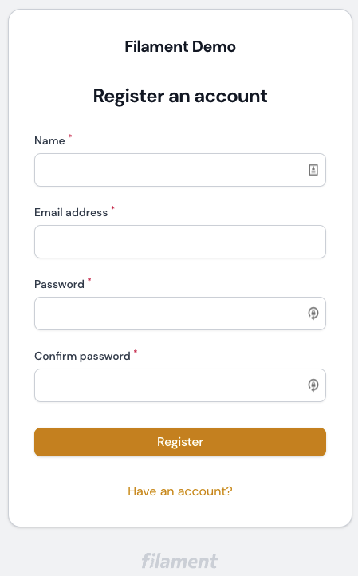
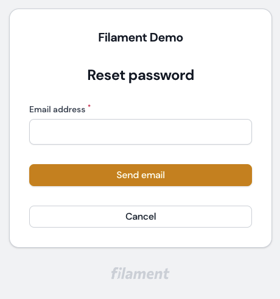
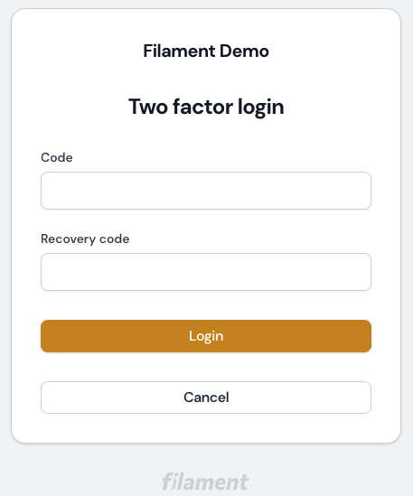
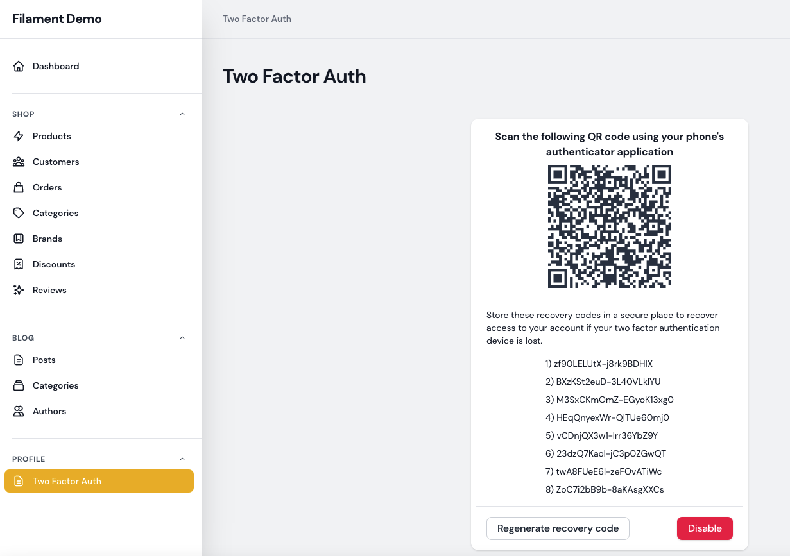

# Laravel Fortify for Filament Admin

[](https://packagist.org/packages/wychoong/filament-fortify)
[](https://github.com/wychoong/filament-fortify/actions?query=workflow%3Arun-tests+branch%3Amain)
[](https://github.com/wychoong/filament-fortify/actions?query=workflow%3A"Check+%26+fix+styling"+branch%3Amain)
[](https://packagist.org/packages/wychoong/filament-fortify)

This package provides the UI for using Fortify in Filament Admin Panel

## Screenshots
_Login_


_Register_



_Email Verification_


_Forgot Password_



_Two Factor Login_



_Two Factor Page_



_Password Confirmation_


## Installation

You can install the package via composer:

```bash
composer require wychoong/filament-fortify
```

You can intallation command and run the migrations with:

```bash
php artisan filament-fortify:install 
php artisan migrate
```
The installation command does few things to speed up the installation process:
```
- Publish Fortify files
- Publish Fortify migration
- Add FortifyServiceProvider to config/app.php
```

**As this package is only providing UI for Fortify, kindly refer [Laravel Fortify](https://laravel.com/docs/9.x/fortify) documentation to setup, eg: User model.** 

## Optional

You can publish filament-fortify config file with:

```bash
php artisan vendor:publish --tag="filament-fortify-config"
```

Optionally, you can publish the views using

```bash
php artisan vendor:publish --tag="filament-fortify-views"
```

## Usage

This package respect the features configured in config/fortify.php, refer [Laravel Fortify](https://laravel.com/docs/9.x/fortify) to enable/disable features.

To make the installation seemless, the following configs are overrided in the package.
```php
config([
    ## override filament login page
    'filament.auth.pages.login' => Auth\Login::class,
    ## force fortify view enabled
    'fortify.views' => true,
    ## force fortify to use filament home_url
    'fortify.home' => config('filament.home_url'),
]);
```

#### Email Verification

To allow user access only after email verified, enable the feature in config/fortify.php and update config/filament.php

```php
'middleware' => [
    'auth' => [
        // ...
        'verified'
    ],
    // ...
]

## update your User model

use Illuminate\Contracts\Auth\MustVerifyEmail;

class User extends Authenticatable implements FilamentUser, MustVerifyEmail
{
    // ...
}
```

#### Password Confirmation


To request user password confirmation before access a Page/Resource, add 
```php
protected static string | array $middlewares = ['password.confirm'];
```
to relevant Page/Resource.

#### 2FA
Update your User model
```php
use Laravel\Fortify\TwoFactorAuthenticatable;

class User extends Authenticatable implements FilamentUser
{
    // ...
    use TwoFactorAuthenticatable;
    // ...
}
```
A simple enable/disable user's 2fa page is included. 

You can change the page's title, navigation group, navigation label in service provider:

```php
use WyChoong\FilamentFortify\Facades\FilamentFortify;

public function boot()
{
    FilamentFortify::navigationGroup(__('your-nav-group'));
    FilamentFortify::navigationLabel(__('your-nav-label'));
    FilamentFortify::pageTitle(__('your-page-title'));
}
```

To disable it, publish the config file and set:
```php
    'register-page' => false,
```

## Testing

```bash
composer test
```

## Changelog

Please see [CHANGELOG](CHANGELOG.md) for more information on what has changed recently.

## Contributing

Please see [CONTRIBUTING](.github/CONTRIBUTING.md) for details.

## Security Vulnerabilities

Please review [our security policy](../../security/policy) on how to report security vulnerabilities.

## Credits

- [wychoong](https://github.com/wychoong)
- [All Contributors](../../contributors)

## License

The MIT License (MIT). Please see [License File](LICENSE.md) for more information.
